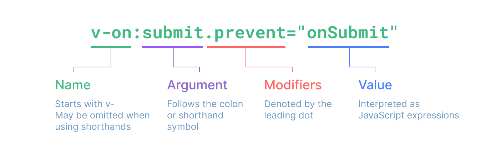

# vue中的js表达式

## 1 往html中插值

```
rawHtml = '<span style="color: red">This should be red.</span>'

1 插入文本：两个花括号之间本没有空格，因为gitbook的原因所以空的
<p>Using text interpolation: { { rawHtml } }</p>
会被替换为
<p>Using text interpolation: <span style="color: red">This should be red.</span></p>

2 插入html，使用v-html属性：
<span v-html="rawHtml"></span>
会被替换为
<span><span style="color: red">This should be red.</span></span>

3 映射标签的属性id到自定义的字段dynamicId上：
<div v-bind:id="dynamicId"></div>
若dynamicId为null 或 undefined，属性id将会从渲染的元素上移除，
可简写为：
<div :id="dynamicId"></div>

4 映射标签的布尔属性disabled到自定义的字段isButtonDisabled上：
<button :disabled="isButtonDisabled">Button</button>
当 isButtonDisabled 为真值或一个空字符串 (即 <button disabled="">) 时，元素会包含这个 disabled attribute。
而当其为其他假值时 attribute 将被忽略。

5 映射JavaScript 对象到标签的属性上
data() {
  return {
    objectOfAttrs: {
      id: 'container',
      class: 'wrapper'
    }
  }
}
<div v-bind="objectOfAttrs"></div>
```

## 2 JavaScript 表达式的使用场景

在Vue 模板内，可以在：

* 在文本插值中 【双大括号内】
* 在任何 [Vue 指令]() (以 v- 开头的特殊属性) 的**值**中【v-**="值"】

```
{ { number + 1 } }

{ { ok ? 'YES' : 'NO' } }

{ { message.split('').reverse().join('') } }

<div :id="`list-${id}`"></div>
```

### 2.1 表达式使用限制

**一、单一表达式**

每个绑定仅支持单一表达式，判断方法：是否可以合法地写在 return 后面。

因此表达式也可写成**调用**其他组件暴露的**方法**：

```
<span :title="toTitleDate(date)">
  { { formatDate(date) } }
</span>
```

>绑定在表达式中的方法在组件每次更新时都会被重新调用，因此**不应该**产生任何副作用，比如**改变数据**或**触发异步**操作。

**二、全局对象**

表达式将被沙盒化，仅能够访问到有限的全局对象列表。该列表中会暴露常用的内置全局对象，比如 Math 和 Date。

而用户附加在 window 上的属性没有显式包含在列表中的全局对象将不能在模板内表达式中，只有在 app.config.globalProperties 上显式地添加，才能访问到。

## 3 vue指令

指令通常期待一个表达式，任务是在其表达式的值变化时响应式地更新 DOM。

>v-for、v-on 和 v-slot则不期待表达式

```
1 v-if 指令会基于表达式 seen 的值的真假来移除/插入该 <p> 元素。
<p v-if="seen">Now you see me</p>

2 v-on监听 DOM 事件
<a v-on:click="doSomething"> ... </a>
可简写为：
<a @click="doSomething"> ... </a>
```

### 3.1 动态参数

指令的参数，写在方括号内，可使用js表达式
```
<a v-on:[eventName]="doSomething"> ... </a>
可简写为：
<a @[eventName]="doSomething">
```

通过计算，`eventName = "click"`,即当点击时，会调用`doSomething()`

#### 3.1.1 值限制

动态参数中表达式的值应当是一个字符串，或者是 null。特殊值 null 意为显式移除该绑定。其他非字符串的值会触发警告。

#### 3.1.2 语法限制

**一、空格和引号**

两者在 HTML 标签的属性名称中都是不合法的。

因此`<a :['foo' + bar]="value"> ... </a>`，即使`'foo' + bar`的结果是一个合法的字符串，但因为空格和单引号的存在都会产生警告，可用[计算属性]()替换复杂的表达式。

**二、大写**

如果你的组件拥有 “someAttr” 属性：

```
const someAttr = 'ddd';
```

且表达式写为：

```
<a :[someAttr]="value"> ... </a>
```

浏览器会强制将表达式的`someAttr`替换为 `someattr`(全部转小写)，最后这段代码将不会工作。

**而单文件组件内的模板不受此限制。**

## 4 修饰符

以点开头的特殊后缀，如 `.prevent` 修饰符会告知 `v-on` 指令对触发的事件调用 `event.preventDefault()`：

```
<form @submit.prevent="onSubmit">...</form>
```

## 5 完整指令格式

